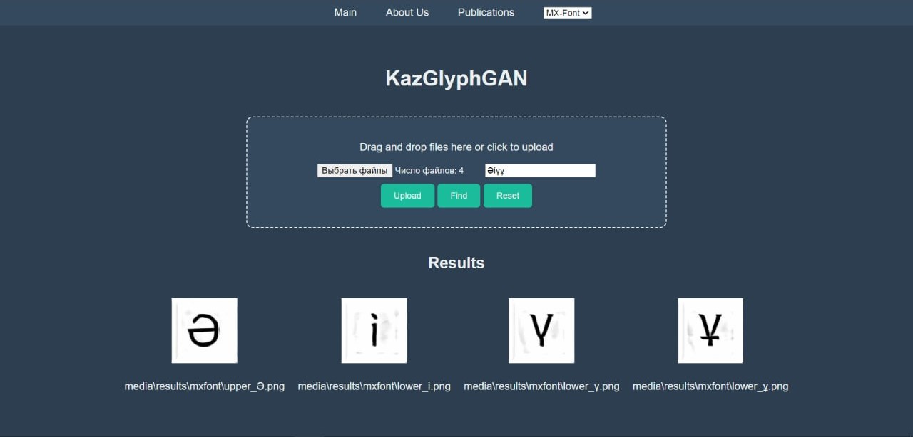
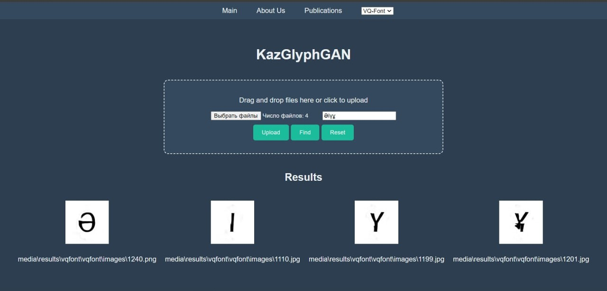
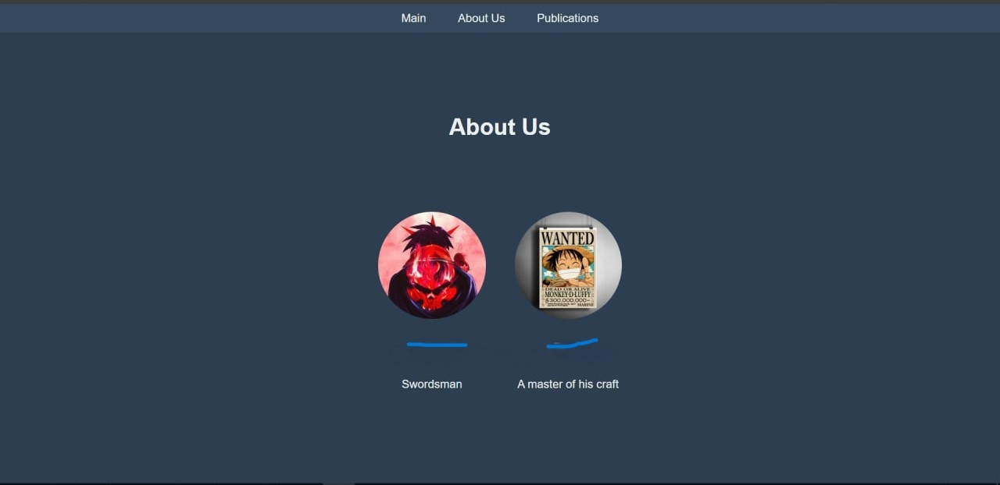

# KazGlyphGAN

KazGlyphGAN is a Django web application designed to upload images and generate Kazakh glyphs using two different models: VQ-Font and MX-Font.



## Table of Contents

- [Installation](#installation)
- [Usage](#usage)
- [Models](#models)
- [File Structure](#file-structure)
- [Pages](#pages)

## Installation

1. Clone the repository:

    ```sh
    git clone https://github.com/Gabrielprogramist/KazGlyphGAN
    cd KazGlyphGAN
    ```

2. Create and activate a virtual environment:

    ```sh
    python -m venv venv
    source venv/bin/activate  # On Windows, use `venv\Scripts\activate`
    ```

3. Install the required dependencies

4. Set up the Django application:

    ```sh
    python manage.py migrate
    python manage.py createsuperuser
    ```

5. Run the development server:

    ```sh
    python manage.py runserver
    ```

## Usage

1. Open your web browser and navigate to `http://127.0.0.1:8000/`.
2. Use the interface to upload images and generate glyphs by selecting the appropriate model (VQ-Font or MX-Font).
3. You can find generated images in the `media/results` directory.

## Models

This project relies on two models for generating glyphs:
- **VQ-Font**: Located in the `vqfont` directory (model files and configurations need to be added).
- **MX-Font**: Located in the `mxfont` directory (model files and configurations need to be added).

### Adding Model Files

Since the `vqfont` and `mxfont` directories are empty in this repository, you need to download or place the necessary model files and configurations into these directories.

1. **VQ-Font**:
    - Download the model weights, inference.py and configuration files and place them in the `vqfont` directory.

2. **MX-Font**:
    - Download the model weights, inference.py and configuration files and place them in the `mxfont` directory.

## File Structure

KazGlyphGAN/<br/>
│<br/>
├── media/ # Contains uploaded images and generated results<br/>
│ ├── uploads/<br/>
│ └── results/<br/>
│<br/>
├── vqfont/ # Placeholder for VQ-Font model files<br/>
│ ├── cfgs/<br/>
│ ├── data/<br/>
│ ├── ...<br/>
│ └── last.pth<br/>
│<br/>
├── mxfont/ # Placeholder for MX-Font model files<br/>
│ ├── cfgs/<br/>
│ ├── data/<br/>
│ ├── ...<br/>
│ └── last.pth<br/>
│<br/>
├── image_processing/ # Django app for image processing<br/>
│ ├── templates/ ...<br/>
│ ├── forms.py<br/>
│ ├── models.py<br/>
│ ├── urls.py<br/>
│ ├── ...<br/>
│ └── views.py<br/>
│<br/>
├── KazGlyphGAN/ # Django project settings<br/>
│ ├── settings.py<br/>
│ ├── urls.py<br/>
│ ├── ...<br/>
│ └── wsgi.py<br/>
│<br/>
├── manage.py # Django management script<br/>
└── README.md # Project documentation<br/>

## Pages




 
